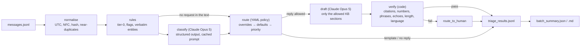

# Lumo contact triage — AI challenge deliverables

A component that takes one incoming customer message and returns a structured, verifiable
result: what it is about, how urgent it is, the details it contains, what to do with it, and,
only when the policy allows it, a Spanish reply grounded in Lumo's knowledge base. Plus a
summary of the whole batch.

Principle: **the model decides what the message is; code decides what to do with it; code
verifies what the model wrote.** Every model call is schema-validated, cached, traced and
replayable without a key.

## Run it

From this folder (`ai_challenge_contact_triage/deliverables/`):

```powershell
.\run.ps1            # Windows
./run.sh             # macOS / Linux
```

The script creates `.venv` if missing, installs the pinned dependencies and processes
`../data/messages.jsonl`. It writes:

| File | Content |
|---|---|
| `output/triage_results.jsonl` | one JSON line per message (schema below) |
| `output/batch_summary.json` | the batch summary as data |
| `output/batch_summary.md` | the batch summary for people |

**No API key needed to reproduce the submitted output.** Every model response of the
submitted run is committed under `cache/`; in the default `auto` mode the pipeline replays
them and only calls the API for a message whose exact request is not cached. To run live with
your own key, copy `.env.example` to `.env` and fill in `ANTHROPIC_API_KEY` (or export it);
`--mode live` forces fresh calls, `--mode offline` forbids them.

Useful variants (any extra argument is passed through):

```powershell
.\run.ps1 --mode offline                 # reproduce without a key; must equal the committed output
.\run.ps1 --limit 20 --out output\sample.jsonl
.\run.ps1 --model claude-haiku-4-5       # another model (its responses get their own cache folder)
.\run.ps1 --effort low                   # cheaper thinking budget for both stages
python -m lumo_triage classify --ids MSG-003,MSG-016   # classification only, for debugging
python -m lumo_triage summarize          # regenerate the batch summary from the results file
python -m pytest -q                      # 150+ tests, no key needed (one live test is opt-in)
```

Requirements: Python 3.11–3.13 (validated on 3.13 on Windows; the scripts refuse older
interpreters). Dependencies are pinned in `requirements.txt` (`requirements-lock-py313.txt`
is the fully resolved set used for the submitted run).

## What each message gets

```text
id, channel, received_at_utc, sender
dedup           content_hash, duplicate_of, near_duplicate_group
classification  primary_reason, secondary_reasons[], confidence, out_of_scope_kind,
                flags{requests_human, fraud_or_security, legal_threat, collections_harassment,
                      vulnerable_customer, imminent_deadline, repeat_contact,
                      prompt_injection_suspected, pii_present},
                entities{credit_number, document_number, amount, payment_date,
                         transaction_reference, payment_method_or_bank, named_agent, masked_values[]},
                sentiment, language, summary, reasoning_brief
decision        priority P0–P4, sla_hours, action, queue, policy_coverage, policy_gap, reason_codes[]
draft_reply     text | null, source (llm | template | none), kb_citations[], verifier{passed, checks[]},
                rejected_text (a draft that failed verification, kept for the agent, never sent)
processing      pipeline_version, rules_applied[], model, served_by, effort, llm_calls, tokens,
                response_cache_hits, latency_ms, cost_usd, llm_error
```

Actions: `auto_reply` (send the draft), `auto_reply_and_route` (send the draft as an
acknowledgement and open a case), `route_to_human` (no draft; a person answers from the queue),
`close_no_reply`. Every entity value appears verbatim in the message; every number in a draft
appears in a cited policy section or in the customer's own text; `policy_gap` names what the
knowledge base did not cover.

## How it works



| Stage | Module | Decides |
|---|---|---|
| Normalise and deduplicate | `lumo_triage/normalize.py` | UTC timestamps (naive = Bogotá), content hash, exact and near duplicates |
| Rules | `lumo_triage/rules.py`, `extract.py` | noise / greeting / closure without a model call; high-precision flags; entities verified verbatim |
| Classification | `lumo_triage/classify.py`, `llm.py` | primary and secondary reason, flags, entities, confidence; prompt rendered from `policy/taxonomy.yaml` |
| Routing | `lumo_triage/routing.py`, `policy/routing.yaml` | priority, action, queue, reply source, allowed KB sections |
| Drafting | `lumo_triage/draft.py`, `kb.py` | Spanish reply from the allowed sections, with citations and uncovered points |
| Verification | `lumo_triage/verify.py` | eight checks; a failure routes to a person |
| Summary | `lumo_triage/summary.py` | batch figures computed from the records only |

## Documents

| File | What it is for |
|---|---|
| `HOW_I_WORKED.md` | required write-up: tools, validation, where the AI was wrong, what I would improve |
| `DESIGN.md` | architecture, decisions, prompt versions, scale and cost at 10,000 messages a day |
| `TAXONOMY.md` | taxonomy v2: what changed from the CX draft and why, with message ids |
| `EVALUATION.md` | gold set, metrics, error analysis |
| `IMPLEMENTATION_PLAN.md` | the plan and the decision log (D1–D12) |
| `WORKLOG.md` | one entry per step with commands, results, incidents and commit |
| `evidence/` | `message_profiling.md`, `classification_run.md`, `llm_calls.jsonl` (one line per live call), eval reports |
| `cache/` | committed model responses, one JSON per (model, purpose, message, request fingerprint) |

## Layout

```text
deliverables/
  run.ps1, run.sh          single command
  lumo_triage/             the package (policy/ holds taxonomy.yaml and routing.yaml)
  tests/                   pytest suite (policy consistency, deterministic layer, classifier,
                           routing, drafting and verifier, summary and reproducibility)
  scripts/                 evidence generators (profiling, classification summary)
  output/                  results of the submitted run
  evidence/, cache/        traces and replayable responses
```
