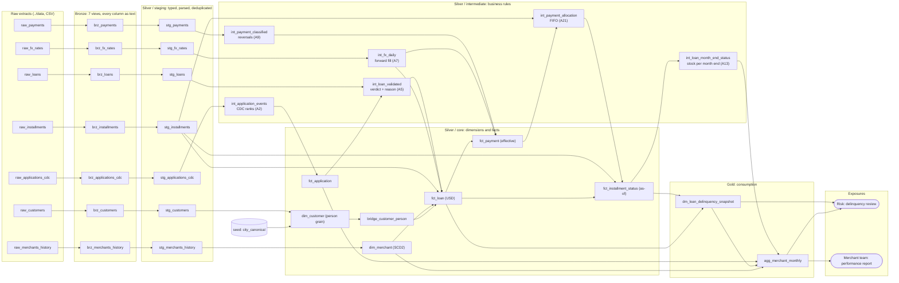
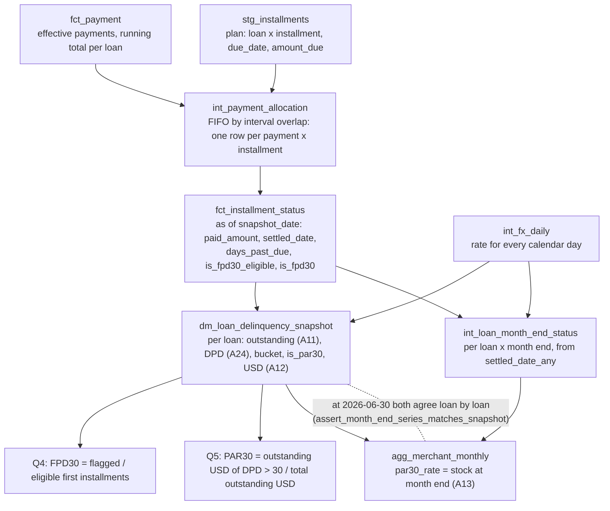
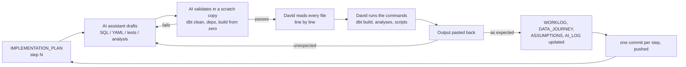
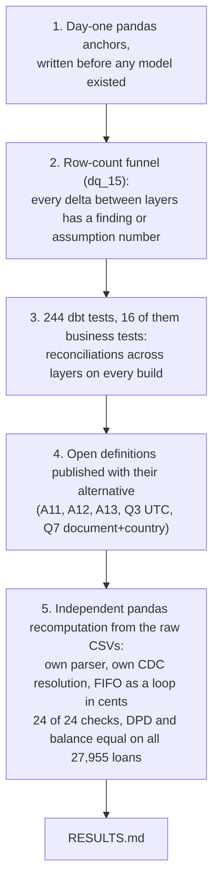

# Architecture — how the warehouse is built and how the numbers flow

Diagrams are Mermaid; GitHub renders them inline. In VS Code, use the "Markdown Preview Mermaid
Support" extension or read the text form under each diagram.

## 1. Lineage: from the seven CSV extracts to the two gold models



Text form: each CSV is read 1:1 into a bronze view; staging types and deduplicates it;
intermediate models apply one business rule each (CDC final state, FX calendar, loan validity,
reversal classification, FIFO allocation, month-end series); core models are the six entities
the README asks for; the two gold models aggregate and classify; two exposures name the
consumers. Layer responsibilities:

| Layer | Schema | Materialization | Responsibility | Must not do |
|---|---|---|---|---|
| Bronze | `bronze` | view | show the extract exactly as delivered | cast, filter, deduplicate |
| Staging | `silver` | view | types, timestamp parsing (3 shapes), Bogotá dates, exact dedup, sentinels | apply business rules |
| Intermediate | `silver` | table | one business rule per model, keeping every row with a flag or a reason | drop rows silently |
| Core | `silver` | table | the entities at their declared grain, filtered by the rules | recompute upstream logic |
| Gold | `gold` | table | aggregate and classify for consumers | re-implement FIFO or as-of logic |
| dq_audit | `dq_audit` | tables | rows that failed each test (`store_failures`) | |

## 2. How the risk metrics are produced (Q4, Q5 and the monthly PAR30)



### FIFO by interval overlap (no recursion)

Per loan, installments form consecutive segments on a *debt line* and payments form consecutive
segments on a *money line*; a payment funds an installment by the length of the overlap.

```
debt line   |---- inst 1: 428,600 ----|---- inst 2: 428,600 ----|---- inst 3: 428,600 ----|
            0                     428,600                   857,200                 1,285,800
money line  |------------ payment A: 857,200 ---------------|--- payment B: 428,600 ---|
            0                                           857,200                 1,285,800

allocation: A -> inst 1: 428,600   A -> inst 2: 428,600   B -> inst 3: 428,600
settled_date(inst 1) = settled_date(inst 2) = date of A ;  settled_date(inst 3) = date of B
```

Real example from the data (`int_payment_allocation`, loan with the split payment 4000023):
one payment of 857,200 covers installments 1 and 2; installment 4 (428,500) is completed by two
payments of 257,100 and 171,400. Four singular tests guarantee conservation: no payment funds
more than its amount, no installment receives more than its due, money never reaches a later
installment while an earlier one is unsettled, and per loan allocated = received capped at the
plan total.

## 3. The working method (one loop per step, 00 to 19)



Every arrow back to *draft* is an entry in `DATA_JOURNEY.md` section C (error ledger) and, when
the assistant was the cause, in `AI_LOG.md` section 3.

## 4. How the published figures were verified



## 5. Where each README requirement is met

| README 4.x requirement | Where |
|---|---|
| 4.1 Silver: `dim_customer` (real person), `dim_merchant` (SCD2), `fct_application`, `fct_loan` (USD), `fct_payment` (effective), `fct_installment_status` (grain loan × installment) | `models/silver/core/` |
| 4.1 Gold: `agg_merchant_monthly` with category as of the event date; `dm_loan_delinquency_snapshot` as of 2026-06-30 | `models/gold/` |
| 4.2 Business day in Bogotá | macros `to_business_date`, A6 |
| 4.2 GMV at disbursement-date rate | `fct_loan.principal_usd`, `int_fx_daily`, A7 |
| 4.2 Approval rate, FPD30, PAR30, loan DPD | `fct_application`, `fct_installment_status`, `dm_loan_delinquency_snapshot`, A23, A24 |
| 4.2 FIFO payment allocation | `int_payment_allocation`, A21, four conservation tests |
| 4.3 Seven questions with figures and the producing model or query | `RESULTS.md`, `analyses/results/`, `evidence/results.md` |
| 4.4 Tests: grain keys, referential integrity, ranges, accepted values, at least two business tests | 244 tests, 16 singular, `DATA_QUALITY.md` |
| 4.4 Documentation of gold models and non-trivial columns; grain in every description | `models/*/*.yml`, `dbt docs generate` |
| 4.5 Nice to have | exposures done; incremental, late arrivals, snapshot, contracts described in `ASSUMPTIONS.md` §C |
| 5 Deliverables layout | this folder |
| 6 AI log | `AI_LOG.md` (4 sections, 7 error cases) |
| Top-level: reproducible commands, verifiable without re-running | `README.md`, `evidence/` (queries, cross-check, dbt artefacts, build log) |
